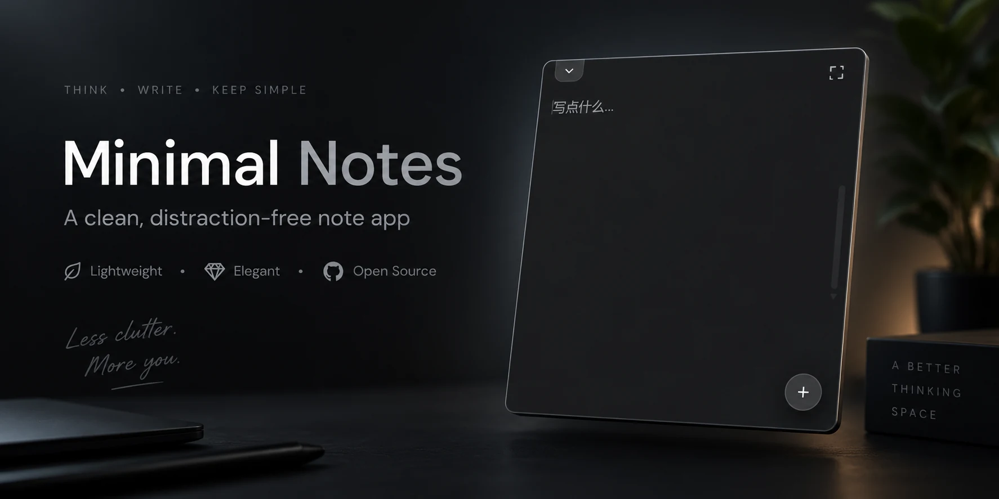

# HoverNote

屏幕角上折起的一角。鼠标浮上去，笔记就从那个角展开。

*A hover-to-open sticky note that lives in the corner of your Windows desktop.*



**仅支持 Windows 11。** 贴角、置顶、透明、DPI 跟随这几件事全部直接调 Win32
（`user32` / `dwmapi`），没有跨平台兜底，在别的系统上编译不过。常驻内存约 26 MB，
安装包 5–10 MB。

## 快速开始

需要 Rust stable + MSVC 工具链。WebView2 是 Windows 11 自带的，不用装。

```bash
git clone <this-repo> && cd HoverNote/src-tauri && cargo build --release
```

然后双击项目根目录的 `安装.bat`（装到当前用户目录，不需要管理员权限）。
笔记默认存在 `%USERPROFILE%\Documents\HoverNote\`，想换个地方：

```bash
powershell -ExecutionPolicy Bypass -File tools/install.ps1 -DataDir "D:\我的笔记"
```

细节见下面的[一键安装](#一键安装)和[数据](#数据)两节。

## 为什么是 Tauri 而不是 Electron

这个东西要 24 小时挂在屏幕角上，常驻开销就是它的全部成本：

| | Tauri | Electron |
| --- | --- | --- |
| 空转内存 | 约 32 MB（实测） | 约 120–180 MB |
| 安装包 | 5–10 MB | 150 MB+ |
| 渲染层 | 复用系统 WebView2 | 自带 Chromium |

## 交互

- **折角**：一枚 28 逻辑像素的黑色卷页角（高 DPI 下由系统等比放大），直角顶死屏幕
  工作区的角，不留边距。用的就是提供的那张原图（`tools/assets/fold-reference.webp`），
  不是照着它手绘的近似——那张图的白纸部分本身就是透明的，正好是「只有卷角、其余留空」
  的形式，卷角的直角顶点也已经顶在右下角（实测离边 2/1254 px）。鼠标浮上去笔记就展开，
  点一下收起。拖动只能在四个角之间换位置——它不会跟着鼠标走，拖动的语义是「挑一个角」，
  所以它停不到边上，也飘不到屏幕中间。换角时整体镜像，折痕和投影跟着翻。

  贴角的位置**不是只算一次**。它依赖两样随时会变的东西：显示器工作区和显示缩放。
  开机自启最容易撞上——登录那一刻任务栏可能还没建出来，工作区就是整块屏幕，折角被
  摆到屏幕最底下，等任务栏出现它就悬在半空。改分辨率、把任务栏挪到别的边、开关自动
  隐藏、插拔显示器，同样会让原先贴死的位置失效；跨到不同缩放的显示器上更麻烦，系统
  是在窗口移动**之后**才重新缩放它，按旧尺寸算出的位置会留出一条缝。这些没有统一可靠
  的通知点，所以改成每 400ms 校一次（三次 Win32 调用，代价可忽略，且对所有成因一视
  同仁）。校正幂等，贴死之后就什么都不做。

  校正里**位置每一轮都算，不排在尺寸后面**。右下角的位置确实要拿尺寸倒推，但改分辨率
  会连带改 DPI，系统在 `WM_DPICHANGED` 里会按自己的建议矩形回改窗口，和这里的
  `set_size` 顶牛；早先的写法是尺寸没对上就 `continue`，只要有一轮收不干净，几次循环
  就全耗在尺寸上，位置的代码一次都跑不到——而函数照样报「动过了」，于是折角一直歪着，
  每 400ms 白转一次。现在位置一律按**当前实际**尺寸算，尺寸暂时差几像素也还是贴着边的，
  尺寸下一轮再收。

  缩放倍率直接问 `GetDpiForWindow`，不用 tao 缓存的 `scale_factor()`：那个值是它处理
  `WM_DPICHANGED` 时才更新的，而最要紧的恰恰是改分辨率那一瞬间，缓存里可能还是旧倍率。
  拿不到倍率就**不动尺寸**，绝不退回 1.0 猜一个——在 200% 的屏上猜错就是把折角改成
  一半大，还会引出下一轮改回去来回折腾。

  「上次在哪」（存档里的 `orb`，只用来在下次启动时认是哪块显示器）在自动校正挪动后也会
  跟着更新。原先只有用户手动拖动才写，于是插拔外接屏之后它一直停在旧坐标上，下次启动
  可能把折角摆到一块已经不存在的区域附近。

  `tools/snap-test.ps1`、`tools/workarea-test.ps1`、`tools/offscreen-test.ps1` 分别用
  「强行挪走 / 改大窗口」「直接改工作区」「甩到屏幕外（含负坐标）」验证这条路径。最后
  那一档是分辨率变小的真实后果——旧坐标整个落在新桌面之外，认显示器时得靠
  `MONITOR_DEFAULTTONEAREST` 兜底，走的是另一条分支。
- **面板**：同样贴死在那个角上，折角正好压在它自己的角上并往上面投影。
- **自动隐藏**：鼠标划过展开、又移开，面板就收起；一旦点进去开始编辑，就只在
  面板失焦时才收，不会打字打到一半消失。
- **改尺寸**：面板四边四角 6px 内按住拖动，松手后自动贴回当前的角。
- **放大**：右上角按钮把面板放到屏幕中间放大，此时不自动隐藏，仍可拖动和缩放；
  放大后的尺寸和位置都会记住，下次放大直接还原。再点一次缩回原来那个角。
- **新建**：右下角圆形加号，或笔记栏末尾那一行。命名规则是找第一个没被占用的
  `Note_N`，但建完不会就这么放着——笔记栏会拉出来，光标直接落在名字上并全选，
  打字就是覆盖。新建之后第一件事几乎总是起名字，而名字只在笔记栏里能改（编辑区
  没有标题栏），让人自己翻出列表再双击是白绕一圈；`Note_3` 这种占位名也没什么
  可留的。

  起名字这段时间笔记栏**不会因为鼠标移开而收起**——要打字的输入框就画在里面，
  收了就没了。回车定下、Esc 放弃、或者点到笔记栏外面去（输入框失焦），三条路
  任意一条走完，它才交还给平时那套悬停开合：这时鼠标要是已经不在笔记栏上了就
  立刻收起，还停在上面就接着开着。新建那次改完名字焦点接着落到正文里——那本来
  就是新建笔记的落点，只是中间插了一步起名字。
- **笔记栏**：左上角的书签页签，鼠标浮上去向下拉出全部笔记，点页签钉住、再点收起。
  行内悬停出现右侧的删除按钮；**改标题只在这里做**——**双击**名字进入编辑（新建笔记
  会自动进这一步，见上），回车提交、Esc 取消。悬停和单击都不进编辑：这个列表主要用来
  切笔记，划过一行就冒出输入框会让人以为随时会被改掉，而单击进编辑则会在切换笔记时
  频繁误触发。

  点页签收起是**立刻**的。悬停路径上有 220ms 宽限期——笔记栏 `top: 30px`，和页签之间
  隔着一段，鼠标往下移进笔记栏时会短暂地两边都不在，没有宽限期抽屉会在半途消失——但
  点击是明确的意图，没有空隙要跨，走同一条延迟路径就成了纯粹的卡顿，而且展开是即时的，
  一等就不对称。`tools/drawer-timing.ps1` 采样屏幕像素量这段时序。

  光标掉到笔记栏**下沿以下**就立刻收起，这条比「钉住」优先。往下走只可能是奔着正文去
  的，这时候还支棱着一大片列表挡在上面纯属碍事；往上和左右移开仍然受钉住保护，那几个
  方向本来也够不着正文。改名和拖拽期间不收——一个会把没写完的名字连输入框一起撤掉，
  另一个正需要列表在。

  改名结束时得**主动**收一次。上面这两条收起的路（悬停宽限期、光标掉到下沿以下）都是
  事件驱动的，而人打字的时候鼠标早就移开了，不会再移一次给第二个机会——不补这一下，
  改完名字笔记栏就一直支棱着。收之前先问一句 `:hover`：鼠标要是还停在笔记栏或页签上，
  那本来就该开着。
- **排序和分组**：在笔记栏里按住一行拖动。拖到两行**之间**是排序，拖到某一行的**正中间**
  是把这两篇并成一个组。行高 30px，上下各 8px 判插入、中间 14px 判并组；插入画一条横线，
  并组则把整行圈起来——这两个动作的结果差得远，提示不能长得像。

  组只有一层，组里不套组：面板只有 380px 宽，再深一层缩进就没地方放字了，落点判定也会
  失去分寸。组名的改法和笔记名一样（双击），单击标题行收起/展开，收起时右侧报成员数。
  标题行上那枚 × 是**解散**不是删除——笔记会回到顶层，一篇都不会少，所以它也不染红：
  和隔壁那枚真会删掉一篇笔记的 × 用同样的红色，迟早会按错。

  数据上笔记始终是**平铺**的一个数组，顺序就是显示顺序；归属只写在 `note.group` 里，
  组画在它第一个成员的位置上。一处记录归属，就不会出现「组里说有、笔记说没有」这种
  对不上的状态，后端那套按 id 求差集认删除的逻辑（见下面「删除」）也原样还能用。
  「一个组最后一个成员的下沿」判给顶层，否则一个组后面就再也插不进东西，想把笔记排到
  两个组之间会没有落点；往组末尾追加改用「摞到最后一个成员上」去够。
- **查找**：Ctrl+F 从顶上浮下一条窄条，命中处染橙、当前那处填实。选中一段再按就拿
  它当关键词（跨行的不要，查找框是单行的，塞进去的换行会被吃掉，搜出来的和选中的
  对不上）。关掉有两条路，退出后的落点不一样：按 Esc 是「就改这个词」，光标落在当前
  命中处；**在正文里点一下**也收起，这时光标留在刚点的地方——那一下点击已经表达了
  要去哪儿，再把人拽回旧的命中处就成了倒忙。点正文这条走 `click` 不走 `pointerdown`：
  收起要重画整个编辑区，按下那一刻光标还没放进去，DOM 一换就没了着落，拖着选一段
  更会断在半路。
- **托盘**：右键菜单可以呼出笔记、把折角复位到右下角、退出。

编辑区里没有标题栏，只有正文。

## 关于毛玻璃

界面是**中性深灰半透明**（窗口透明 + CSS 半透明底色，桌面直接透过来），没有高斯模糊。
不是没做，是三条路在 Windows 11 上都试过且都不可用：

| 方案 | 结果 |
| --- | --- |
| `window-vibrancy::apply_acrylic`（`SetWindowCompositionAttribute`） | 退化成一块不透明死灰，完全不模糊 |
| `window-vibrancy::apply_blur` | 纯黑不透明 |
| DWM `DWMWA_SYSTEMBACKDROP_TYPE` | 和 tao 的 `transparent: true` 互斥（透明窗口是靠空模糊区域实现的），且 `DwmExtendFrameIntoClientArea` 会把系统标题栏按钮画出来 |

已确认系统侧「透明效果」是开着的、非远程会话，所以不是环境问题。真透明这条路是
唯一可用的，观感上也满足要求，就没有再留一条只会产出不透明板子的死代码。

底色是 `rgba(38, 38, 38, 0.88)`，压在桌面上实测渲染成 RGB(33, 33, 33)。三个文字
颜色变量（`--text` / `--dim` / `--faint`）都是 R=G=B 的中性灰：原来那组值蓝色分量
比红色高，在近黑底上看不出来，底色抬到深灰之后整体会泛紫。`--dim` 和 `--faint`
同时调亮了一档——背景变浅，原来的灰字对比度不够会发糊。

## 开发

需要 Rust stable + MSVC 工具链 + WebView2（Win11 自带）。

```bash
cd src-tauri && cargo run
```

打包成安装器：

```bash
cd src-tauri && cargo tauri build
```

重新生成图标（换了 `tools/assets/` 下那两张源图之后）：

```bash
python tools/gen-icons.py
```

两张源图各管一头：`fold-reference.webp` 只有卷角、其余透明，重采样成折角窗口用的
`src/assets/fold.png`；`app-icon.png` 是成品应用图标，只缩放不再合成。需要 Pillow。

**图标改完必须重新 `cargo build --release`**——它是编译期嵌进 exe 资源里的，光换
文件，装好的那个 exe 不会有任何变化。`build.rs` 里加了 `rerun-if-changed=icons`，
否则 cargo 认为什么都没变、不重跑构建脚本，链进去的还是上一次那份资源；这种失败
是无声的，编译照样成功。

排查窗口显隐问题时打开诊断日志：

```bash
HOVERNOTE_TRACE=1 ./src-tauri/target/debug/hovernote.exe
```

这类置顶小窗从外部观察极不可靠——截屏抓不到合成层，光标一动状态就变，
所以显隐路径上留了程序自报的日志。`tools/probe.ps1` 可以列窗口矩形、截屏、
模拟点击和拖拽，是验证几何的主要手段。

## 数据

笔记全部存在一个 `hovernote.json` 里，目录按这个顺序定（`state.rs` 的
`resolve_store_dir`）：

1. 环境变量 **`HOVERNOTE_DIR`**，
2. 没设就是 **`%USERPROFILE%\Documents\HoverNote\`**。

**不放 `%APPDATA%`**——那在系统盘，重装/重置/恢复出厂时最容易被连带清掉，而且是
做备份时通常不会特意勾选的目录。文档目录至少是人人都会备份的那个地方。

留环境变量这个口子是因为「笔记该放哪」没有一个对所有人都对的答案：有人有单独的
数据盘，有人整个用户目录都在同步盘里。写死一个路径等于逼别人改代码重编。
`tools/install.ps1 -DataDir "D:\我的笔记"` 会把它写进用户级环境变量，之后每次
启动都生效。

变量只在启动时读一次。中途改它不该让读和写落到两个不同的地方——那意味着一次
保存会把笔记写进一个谁也不会再去读的目录。

丢数据这件事上做了四件事：

- **落盘顺序**：写临时文件 → `fsync` → 重命名 → `fsync` 目录。只有 write + rename
  是不够的：NTFS 上 rename 的原子性只覆盖元数据，内容和目录项都可能还在缓存里，
  进程崩溃扛得住但**断电扛不住**。
- **上一版留底**：每次覆盖前把当前文件复制成 `hovernote.bak`，误删和写坏都还有
  一次回头的机会。
- **读不出来就绝不写盘**：读失败（文件被杀毒/备份程序锁住、瞬时 IO 错误、JSON 坏掉）
  时内存里是一份空数据，这时候照常保存就会把磁盘上的好笔记覆盖成空的，且不可逆。
  所以 `load` 区分"文件不存在"（正常首次运行）和"读不出来"（异常），后者会把坏文件
  改名成 `hovernote.broken-<n>.json` 留证，并让这一整轮运行进入只读模式。
- **回收站**：删掉的笔记只要正文不是空的，就会在笔记目录的 `trash\` 下留一份
  `20260823-222352 标题.md`，头部记着标题、id 和删除时间。一篇笔记是 JSON 里的
  一个条目而不是一个文件，所以 Windows 回收站从来管不着它；`hovernote.bak` 只保留
  上一次保存前的状态，而保存的触发很密（打字 400ms 防抖、切笔记、展开、缩放、退出），
  想靠它找回删掉的东西窗口只有几秒。空笔记不留——新建了没写字就删掉是常事，
  留下来只会把这个文件夹塞满噪音。

  删除本身不单独通知后端：前端只是把整份笔记列表重新送上来，后端拿新旧两份做差集
  认出少了哪些。这样无论前端从哪条路径把笔记弄没了都能兜住，不依赖某个删除按钮
  记得去调某个接口。误判的代价只是回收站里多一个文件，漏判才是真的丢东西。

面板尺寸**按显示配置分开记**。指纹形如 `3840x2160@192`（显示器整块矩形 + DPI），
每套配置各存一份贴角尺寸和放大尺寸/位置，最近用过的排最前，最多留 16 套。

为什么不能只存一份：尺寸存的是**逻辑像素**，逻辑像素只保证「换块屏之后看着一样大」，
保证不了「装得下」。在 4K 上拉到 600×1000 的面板换到 1080p 上就顶到天花板，人一定会
去改小——改小本身没错，错的是只有一个格子时，这一改连 4K 那份也跟着没了，切回去
就是一块变小的板子。分开记之后两边各是各的。

指纹用显示器的**整块矩形**而不是工作区：任务栏改自动隐藏、挪到别的边、多排一行都会
让工作区变化，可那不是「换了块屏」，不该另起一份记忆、更不该把已经记好的挤掉。带上
DPI 则是因为同样分辨率配不同缩放是两种完全不同的观感，记成同一份等于没分。

这套记忆能成立，前提是先修掉一个会把存档**写坏**的问题。改分辨率时系统会在
`WM_DPICHANGED` 里按比例把窗口重排一遍，那次重排会顺着前端的 `onResized` 走到
`panel_geometry`；而 tao 缓存的 `scale_factor()` 要等它自己处理完那条消息才更新，
这当口拿它去把物理尺寸换算成逻辑尺寸，得到的数字正好差一个 DPI 倍率——存进去就是
永久的，下次切回这块屏是照着错的还原。所以换算一律走 `GetDpiForWindow`，拿不到
倍率就**这次不记**，宁可少记一次也不能记错。

还有两处顺序上的讲究：

- **先认屏，再记尺寸**。轮询和 resize 回调谁先到没有保证，只要记录先跑一步，就等于
  拿旧屏的尺寸盖掉新屏上次调好的那份。所以两条路都先过 `sync_layout`，只要判出
  「换了」或「正在变」就这一轮不记。
- **连着读到两次一样的才认**。窗口的 DPI 上下文和它所在显示器的坐标空间会短暂对不上，
  那当口量出来的是个根本不存在的配置——实测启动那一瞬间，唯一那块 3840x2160@192 的
  屏被报成了 `1920x1080@168`。认下去会在表里留一套幽灵配置，更糟的是可能拿它那份
  尺寸去摆窗口。这道去抖不关心读数为什么会错，一闪而过的就是过不去。

放大面板的位置存物理屏幕坐标，恢复时夹回当前工作区。贴角尺寸摆出去时也夹回工作区，
但**只夹这次摆出来的值，存档里那份原样不动**——不然从大屏切到小屏被夹一次，再切回
大屏就永远回不到原来那么大了。旧版物理像素尺寸会自动重置，笔记内容不受影响。

`tools/display-probe.ps1` 把系统里实际有的显示器、每个窗口算出来的指纹、和存档里
那张表并排列出来，用来确认三者对得上。

## 一键安装

先构建 release，然后双击项目根目录的 `安装.bat`。脚本使用当前用户目录安装，
无需管理员权限；它会创建可搜索的开始菜单快捷方式、登记登录后自动启动、复制自定义
图标，并启动 HoverNote。右下角通知区域图标的右键菜单可随时退出进程。

```bash
# 换个地方存笔记（写进用户级环境变量 HOVERNOTE_DIR，之后每次启动都生效）
powershell -ExecutionPolicy Bypass -File tools/install.ps1 -DataDir "D:\我的笔记"

# 装但不开机自启
powershell -ExecutionPolicy Bypass -File tools/install.ps1 -NoAutoStart

# 卸载
powershell -ExecutionPolicy Bypass -File tools/install.ps1 -Uninstall
```

**卸载不删笔记**，也不清 `HOVERNOTE_DIR`。卸载和「不要这些笔记了」是两件事，
替人做后一个决定没有回头路；变量留着，重新装回来还能对上原来那批笔记。

自启走**「启动」文件夹**里的一枚快捷方式，会出现在「设置 → 应用 → 启动」里，可以
自己开关。不写 HKCU 的 `Run` 键——两处同时登记会在那份列表里出现两条同名项，关掉
一条另一条照跑。快捷方式直接指向 GUI 子系统的 exe，登录时不经过控制台宿主，不闪黑框。

冷启动要等 WebView2 起来，实测约 30–40 秒才会看到折角，之后常驻内存约 26 MB。
这段时间里进程已经在跑，只是窗口还没建出来。

## 结构

```
LICENSE            MIT
安装.bat           双击安装，转调 tools/install.ps1
docs/hero.webp     README 顶上那张概念图
src/               前端，纯静态无打包器（withGlobalTauri）
  orb.html         折角窗口
  index.html       笔记面板窗口
  assets/fold.png  折角图，由原图重采样而来
src-tauri/src/
  lib.rs           窗口编排、贴角、拖角、自动隐藏、托盘
  platform.rs      Win32：DWM 圆角/边框、窗口样式、工作区、光标、置顶重排、显示指纹
  state.rs         持久化、笔记目录解析、回收站
tools/install.ps1    安装/卸载/设笔记目录（-DataDir）
tools/assets/fold-reference.webp  卷角原图，折角小窗的来源
tools/assets/app-icon.png         成品应用图标，exe/托盘/快捷方式的来源
tools/gen-icons.py   从上面两张源图生成折角图和应用/托盘图标（需 Pillow）
tools/probe.ps1      窗口矩形 / 截屏 / 模拟输入，验证用
tools/wins.ps1       按 PID 枚举顶层窗口，排查启动问题
tools/snap-test.ps1      挪走/改大折角，看它多久自己校回角上
tools/offscreen-test.ps1 把折角甩到屏幕外（含负坐标），验证它还回得来
tools/workarea-test.ps1  临时改工作区，验证折角跟着走（测完还原）
tools/display-probe.ps1  列显示器、每个窗口算出的显示指纹、存档里分配置记的尺寸
tools/rename-test.ps1    驱动真实鼠标，验证改名的触发（悬停/单击/双击）
tools/drawer-timing.ps1  采样屏幕像素，量笔记栏收起的时序
tools/tabmark-probe.ps1  按 Tab 走键盘焦点，确认顶栏按钮不再冒系统焦点圈
tools/trash-test.ps1     新建一篇笔记再删掉，验证回收站（分两步，中间看截图确认行号）
tools/color-probe.ps1    采屏幕像素，量面板实际渲染出来的底色
tools/startup-check.ps1  反复重启，统计启动成功率
tools/backdrop.ps1   彩色背板，用来判断面板的透明度
```

`tools/` 下除了 `install.ps1` 和 `gen-icons.py` 之外都是验证脚本，不参与构建。
这类置顶小窗从外部观察极不可靠——截屏抓不到合成层，光标一动状态就变——所以几乎
每条几何和时序的结论背后都有一支对应的探针。

## 测试

```bash
cd src-tauri && cargo test
```

覆盖的是能脱离窗口跑的那部分：分显示配置记尺寸的搬进搬出、笔记目录的解析规则。
贴角、置顶、自动隐藏这些要靠 `tools/` 下的脚本在真实桌面上验。

## 许可证

[MIT](LICENSE)。
